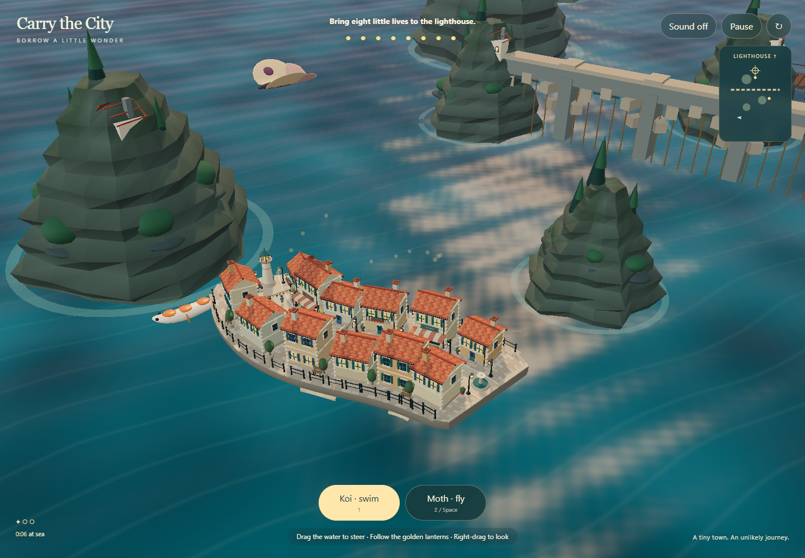
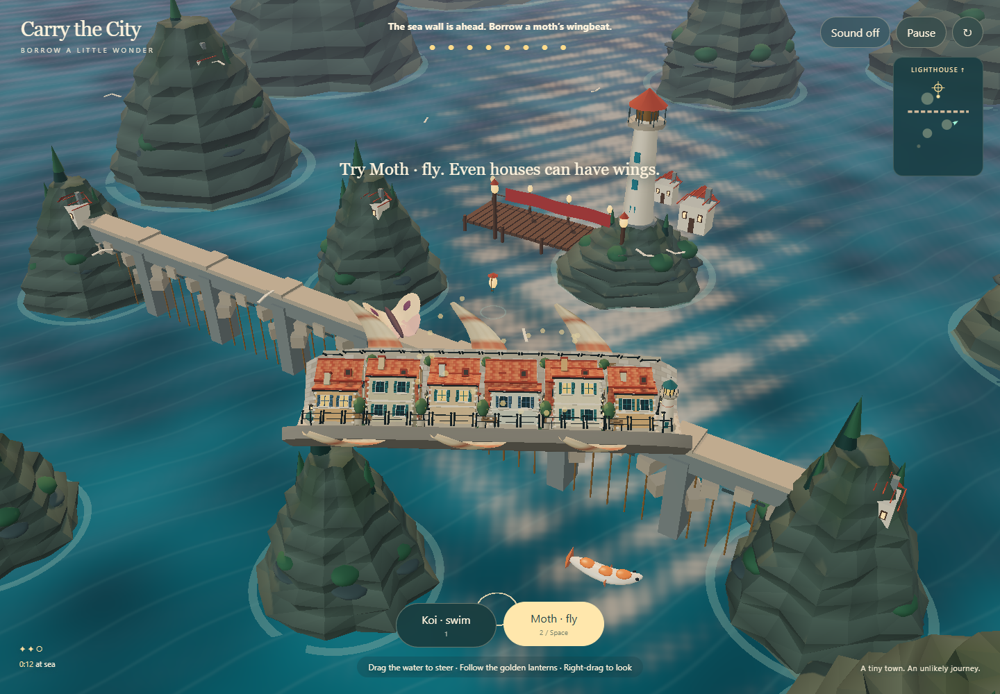

# Carry the City

A small Three.js rescue game: steer an inhabited town through an archipelago,
borrow a koi's swimming motion, then switch to a moth's wingbeat to cross a sea
wall. Return to the water beside the lighthouse to bring eight residents ashore.

This is an experiment in applying one sampled motion field to an interactive
environment. It is not a demonstrated new animation algorithm or physics solver.

## Run

```sh
npm ci
node scripts/run-carry-the-city.mjs --serve
```

Open the printed localhost URL. Click **Borrow the koi's motion**, then drag or
click the water to steer. **1** selects swimming; **2** selects flight; **Space**
switches modes. WASD and the arrow keys also steer. Right-drag changes the view.
The small route map can also be clicked to steer. The three golden lanterns are optional route markers. Cross the wall in flight,
then select swimming and approach the lighthouse's dock to finish. Escape pauses;
R returns to the start. Audio starts off.

The renderer uses WebGL2 through Three.js r186, not WebGPU. Rendering starts idle,
pauses when the page is hidden, and pauses after 90 seconds without input. The
game needs no model download, API credentials, external textures or account.

## Technical combination

`motion.mjs` captures bounded, authored source-marker loops into arrays. A generic
evaluator interpolates those samples and sweeps a local frame along the source
spine. It accepts additional compatible marker clips; it does not infer a rig
from an arbitrary animal or video.

`rig.mjs` blends two point mappings. The same mapping drives:

- Vertices of the town's streets and foundations.
- Positions and orientations of rigid buildings, railings and residents.
- The moving endpoint of a gangway connected to a stationary dock.
- World positions used to compute a released prop's inherited velocity.

Buildings retain their shape while their supporting local frames move. This
avoids separate animation curves for every building. It does not guarantee that
large rigid building footprints remain in contact with a highly curved street.

The potentially reusable part is the agreement between the visible deformation,
its attachments and interactions. Sampled animation, retargeting, swept frames
and finite-difference velocity are established techniques. No speed advantage,
general collision solution or original research result is claimed here.

## Scope

The koi and moth are authored procedural sources, not AI-generated motion.
Player translation and altitude are controlled by game rules; the flapping does
not solve aerodynamic forces. Reef and wall collisions use approximate gameplay
proxies, including capsules along the deforming street's centerline.
Residents follow scripted boarding paths, not a general moving-surface navigation
mesh. The water is a visual shader. AI was used to develop the code and art
reference; no AI model runs during play.

The adjacent `concept.png` is a generated art reference, **not a runtime
screenshot**. Its prompt and provenance are recorded in `CONCEPT.md`.

## Checks

```sh
node --test experiments/carry-the-city/*.test.mjs
node scripts/run-carry-the-city.mjs
```

The browser runner uses an isolated Chrome session with a fixed watchdog. It
drives the game through public controls and bounded simulation steps, saves
runtime screenshots and reports errors. Accelerated simulation steps are not a
measurement of real-time frame rate.

The retained [browser report](evidence/browser-report.json) passed on Chrome 152
on the development Windows/RTX 5070 Ti machine. Actual buttons and water dragging
start the voyage; bounded movement steps complete the route, collect three
lanterns and rescue eight residents. Restart, a separate reef impact, inherited
cargo velocity and disposal are checked. The 17 CPU tests also pass.

A separate two-second observation of the ordinary animation loop recorded 165
application frames in 2,010.8 ms at 1440 × 1000 in headless Chrome. This short
sample is not a full-voyage or cross-device frame-rate guarantee.

These are unedited runtime screenshots of that run:



