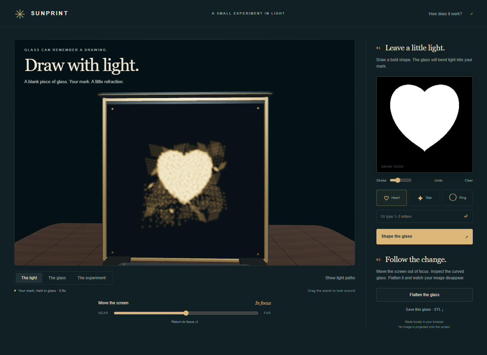
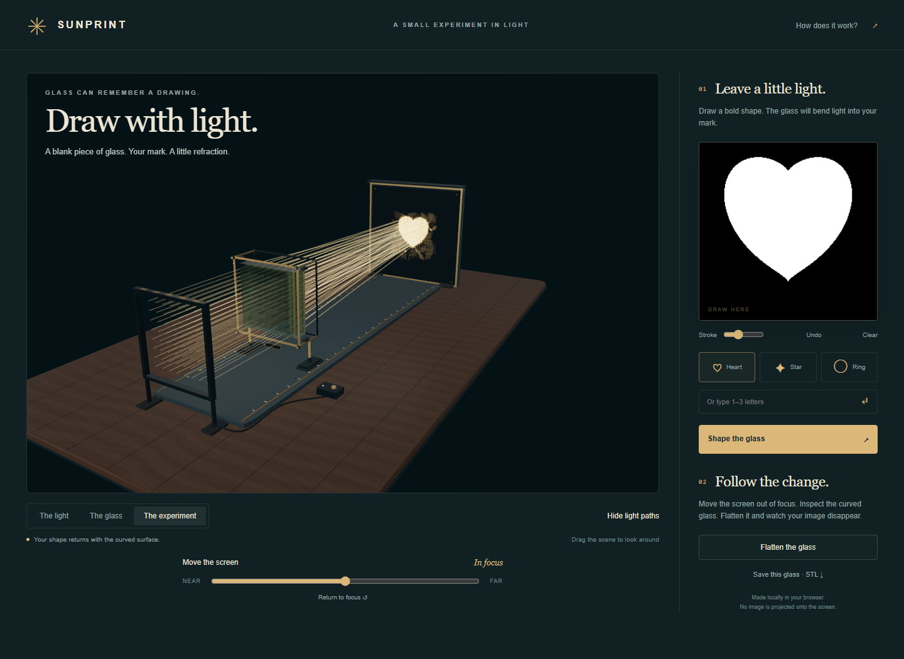

# Sunprint

Draw a mark, and Sunprint optimizes a transparent surface that concentrates a parallel beam into an approximation of that mark. Move the receiver to change the focus, flatten the surface to remove the pattern, inspect the glass, or export its approximate geometry.

This is a browser implementation of established inverse caustic design, with a CPU optimizer and a Three.js r186 / TSL forward photon renderer. It does not establish a new optical principle or a new state-of-the-art solver. See [PRIOR_ART.md](./PRIOR_ART.md).

## Run

From the repository root, after installing its dependencies:

```sh
npm run demo:sunprint
npm run check:sunprint
npm run test:sunprint
```

The demo requires a working WebGPU backend in Chrome or Edge. It serves locally; no model weights, remote inference service, or external art assets are required. The browser check saves screenshots and numerical evidence under `results/development/sunprint/`.



## Recorded checks

The [retained browser report](./evidence/browser-report.json) was produced on September 9, 2026 in the local Pacific time zone (September 10 UTC), with Chrome 152 on Windows. All 19 checks pass. The first heart, pointer-drawn diamond, and typed letters fit in 0.622, 0.676, and 0.684 seconds respectively. These are local worker timings, not end-to-end startup times or a general performance guarantee.

The actual GPU ray positions agree with the independent vector-Snell tracer to within 1.78 × 10⁻⁷ aperture units in the heart fixture. Reading back the actual half-float photon texture gives 0.40% integrated flux error and 0.9994 cosine similarity to the independent ray histogram at 32 × 32 bins. These metrics verify forward implementation consistency, not reproduction accuracy against arbitrary artwork. Display reconstruction uses Gaussian splats of width 0.22 aperture units; residual spill and surface artifacts remain visible.

The browser check also covers receiver motion without modifying the lens, flatten/restore, real pointer input, typed input, STL download, mobile overflow, idle rendering, and disposal. Fifteen separate CPU tests cover the optimizer, mask sampler, transfer protocol, and optical assumptions.



## What is computed

1. The drawing becomes a distribution of target points. A small nonzero background density avoids demanding perfectly dark regions everywhere outside the mark.
2. A worker adjusts a 25 × 25 grid of glass heights. Its default fit uses 48 × 48 source rays and 400 iterations, matching sorted one-dimensional projections of the outgoing and target distributions. This sliced-Wasserstein-style objective uses analytical ray derivatives, Adam updates, a curvature penalty, and bounded surface slopes.
3. The forward GPU pass receives only the heightfield and receiver distance. It loads four heights per sample, differentiates the bilinear surface, applies Snell's law, and projects 128 × 128 rays onto the receiving plane. Normalized Gaussian splats accumulate into a floating-point irradiance texture. Entry and exit Fresnel losses reduce each ray's contribution.
4. The visible lens is sampled from the same heightfield. The receiver displays the photon texture, with a warm color and exposure for presentation. The drawing itself is never supplied to this forward pass.

`gpu.mjs` exposes `createPhotonOptics(renderer, options)` with `update`, `render`, `probe`, `readIrradiance`, and `dispose`. Initialize the renderer first. `probe` reads back 64 GPU ray positions generated by the same TSL function as the visible splats; `optics.mjs` provides a separate vector-Snell implementation with finite-difference surface normals for comparison. The renderer does not support a WebGL fallback.

`readIrradiance()` returns the actual most recently rendered map as packed Float32 RGBA pixels, decoding half floats and removing readback row padding. Row zero is the top of the map, corresponding to analytical positive y; `solver.photonImage()` has the opposite row order. Sum one RGB channel and multiply by pixel area `(2*halfExtent)^2/(width*height)` to estimate transmitted flux retained inside the map. Alpha is a splat count, not energy. The Gaussian splat has width 0.22 scene units and standard deviation approximately 0.02245, chosen to resolve it on the default receiver map. Await readback before disposing the optics.

## Interpretation and limits

- The model assumes a uniform parallel beam entering a flat face normally, one refracting exit heightfield, refractive index 1.49, and a parallel planar receiver. The displayed coordinates reverse the analytical z axis. Orbiting the camera changes the view, not the illumination.
- Fresnel reflection is accounted for as lost transmitted energy. Additional internal reflections, absorption, dispersion, diffraction, rough-surface scattering, and arbitrary scene occluders are not traced. The decorative studio lights do not drive the analytical beam.
- The optimizer fits unweighted ray positions. Its loss is not a calibrated pixel error or a Fresnel-weighted irradiance objective. A lower loss does not guarantee faithful reproduction of every drawing.
- Finite ray counts, a finite receiver map, Gaussian reconstruction, and half-float accumulation affect brightness and sharpness. Rays outside the map are clipped. Bilinear heights are continuous, but their slopes can jump at grid boundaries; dense mesh sampling does not remove those jumps.
- The glass material provides an approximate visual appearance. Its screen-space transmission and nominal thickness are separate from the numerical caustic pass.
- STL export approximates the bilinear surface with triangles in arbitrary length units. It includes no material calibration, manufacturing tolerances, optical polishing model, or measured physical validation. It is an experimental shape, not a fabrication-ready optical design.

The fit runs in one bounded CPU worker and supports cancellation by termination. Rendering is requested when the scene changes rather than running a permanent animation loop. Reported timings and GPU agreement belong to their saved test runs; they are not universal performance guarantees.
