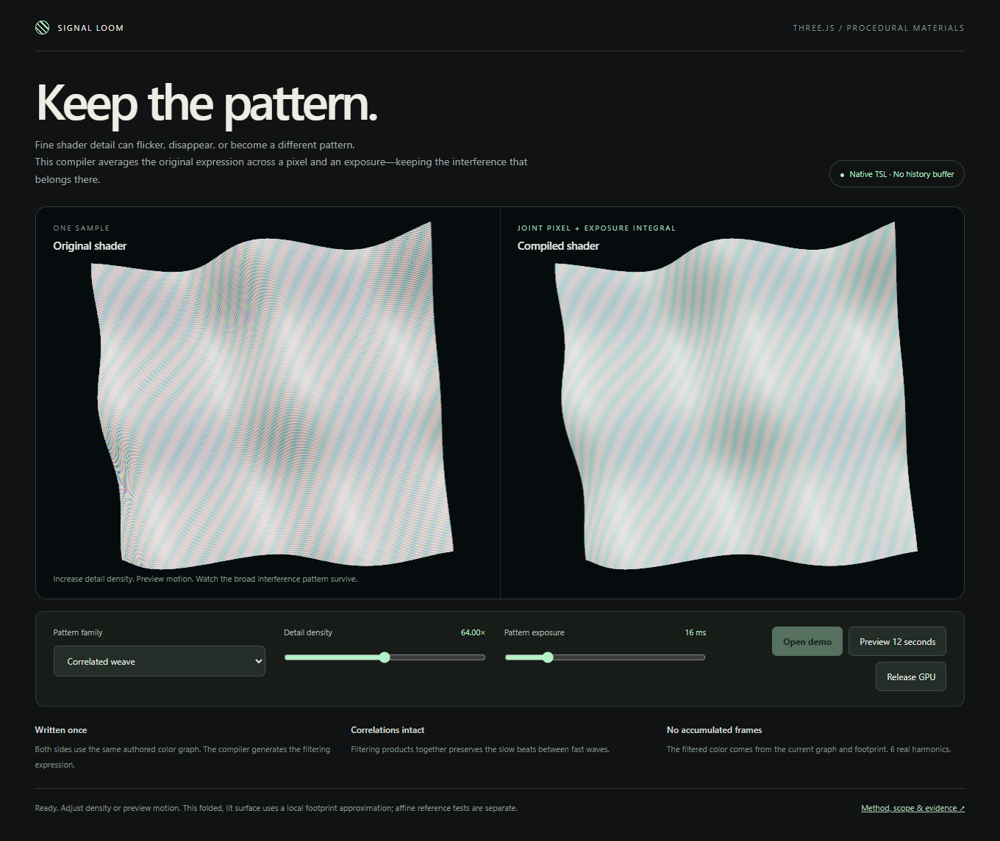

# Native pixel and exposure integration: results

The final fixed GPU screen passes **12/12 correctness cases** and **9/9 utility
cases**. The useful result is an automatic native TSL transformation that matches
a separately derived box integral and avoids severe material aliasing in the
tested finite trigonometric expressions. It does not establish new filtering
mathematics, support for arbitrary shaders, or a rendering speedup.

## What changed visibly

Point sampling confuses unresolved fine waves with different coarse patterns.
The compiler expands their products jointly, then integrates those terms over
pixel and material-exposure coordinates. Correlated waves retain their genuine
slow beat; squared waves retain their nonzero mean. The original graph remains
unchanged, and the transformed native graph supplies a material color input.



The screenshot is the interactive folded, lit, perspective illustration. It is
a local-footprint approximation. The numerical results below concern affine UVs
on a full quad with linear RGB output, not lighting or perspective correctness.

## Complete comparison

Three independently authored programs—correlated weave, squared-wave energy and
three-wave interference—each have magnified, minified, anisotropic and combined
shutter cells. Each cell renders point, compiled, manual analytical and 64-sample
lanes. One calibration plus those lanes gives 49 renders of 96×64 pixels.

Across the nine nonmagnified cells:

- Original point-sampled RGB RMSE: **0.061812–0.256219**.
- Automatically integrated RMSE: **0.000000533–0.000002966**.
- Reduction relative to point sampling: **99.9976%–99.9997%**.
- Matched 64-sample RMSE: **0.000438–0.012686**. The compiler's error is lower
  in all nine cells, by **99.6854%–99.9940%**.

The separately authored analytical shader passes the same per-channel tolerance
and has comparable error. The compiler automates established mathematics; it
does not beat that analytical method. The 64-sample control is 8×8 spatial for
zero shutter, or 4×4×4 space-time for nonzero shutter. These finite sample counts
can themselves alias and are not the exact reference.

At magnification, every lane is already close to the reference. In particular,
point-sampled interference RMSE **2.1041e-6** is lower than compiled **2.7684e-6**;
64-sample interference is **7.2424e-8**. All three magnified 64-sample results are
more accurate than the compiler. These cases remain in the report. No claim that
filtering always helps follows from the challenging cases.

The independent analyzer recomputes all **884,736 lane RGB comparisons** and
**442,368 retained reference values**, validates settings and the complete case
matrix, and applies the separate 2× error-reduction utility gate. Its corruption
tests reject altered rendered pixels, altered reference pixels and omitted cases.
Twenty CPU tests additionally exercise independent quadrature, the actual
generated native graph, correlation, input contracts, mutation rejection and
bounded expression growth.

## Evidence and execution

Final source report: `2026-09-09T22-36-41.222Z-gpu`.
Raw SHA-256: `e62195ffbaa53ad50fb5d70f0798e8e2f16e6cf178cbe302dbd4acb153188fe1`.
The [portable evidence](evidence/README.md) contains full pixels, reference values,
WGSL and source snapshots. Verify without running a GPU:

```sh
npm run test:footprint-filtering
node scripts/analyze-footprint-filtering.mjs --self-test
```

The first attempt (`22-31-26.064Z`) failed a module route before GPU allocation.
After that route was corrected, the first complete screen (`22-32-26.078Z`)
passed. Review then added scalar-shutter API checks and fixed an unrelated stale
UI initialization race. The final complete screen reran those current sources;
the mathematical code and fixed test conditions were not tuned to the result.
Earlier records are retained separately.

Both complete screens used ordinary Chrome 152.0.7977.83, Three 0.185.1 and the
local NVIDIA adapter. Each records zero browser/device/route errors and device
disposal. Pre/post GPU temperature samples were 45°C; those are not peak readings.
Total runtime includes startup, compilation, controls, references and readback,
so it is not a GPU benchmark or a speed comparison.

## What remains outside this result

Finite amplitudes and affine phases define the exact real-arithmetic class;
GPU finite-precision errors are measured separately. Nonlinear phases and
perspective footprints use local derivatives and can require a different filter.
No lighting/visibility integration, geometry motion blur, general texture/noise
support, model inference or broad AI-generated shader corpus was tested.

The native integration is the contribution. Automatic shader filtering has
substantial [prior art](PRIOR_ART.md), including direct compiler precedents.

## Interactive delivery checks

The source UI report `2026-09-09T22-37-55.334Z-ui` passes initial idle state,
three material switches, density/exposure controls, an actual twelve-second
preview cap, mobile layout, release/reopen, and a simulated visibility-change
handler. It also injects a delayed failure from an obsolete initialization and
verifies that the newly opened session survives. The visibility check tests the
handler, not native background-tab event delivery. Browser errors: zero.
