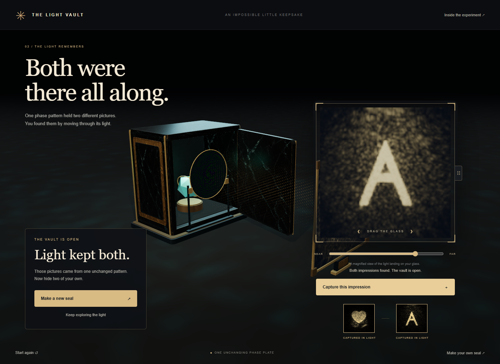

# The Light Vault

Slide a glass card through a beam, find two different pictures, and capture both to open the vault. Both pictures come from **one unchanged phase plate**. Moving the card recomputes how its light interferes at the new distance.

You can also draw two bold marks, fit a new plate locally, and save or reopen the resulting seal. The experiment combines a playable Three.js scene with an inspectable wave-optics component; it does not require an AI service or upload drawings.



## Run and play

From the repository root, with Node.js 22.12 or newer and dependencies installed:

```sh
npm ci
npm run demo:light-vault
```

Open [localhost:5205](http://127.0.0.1:5205/). Native WebGPU is required; there is no WebGL fallback for the propagator. Development has been exercised on Windows with Chrome 152 and an NVIDIA RTX GPU. That is a tested setup, not a minimum hardware specification or a mobile compatibility claim.

1. Drag the magnified glass card left or right. The distance slider, mouse wheel, and arrow keys provide the same control; Shift + arrow moves farther.
2. When a picture resolves, choose **Capture this impression**. Find a different picture to open the vault. Merely reaching a preset position does not unlock it.
3. Choose **Make your own seal**, draw two distinct marks or enter short lettering, and choose **Encode both memories**. A poor fit is rejected with feedback; arbitrary image pairs are not guaranteed to work.
4. **Save this seal** exports JSON; **Open a saved seal** validates and loads it. References are included for checking captures, so this is a portable puzzle file, not encryption or a secret-message security scheme.

The introductory heart and A are formed near 12 mm and 30 mm. The visible apparatus magnifies physical dimensions for readability. The display's large card shows the same GPU texture as the 3D receiver.

## What runs where

- [gpu.mjs](gpu.mjs): native Three.js r186 TSL compute, float32 angular-spectrum propagation, and a separable inverse FFT. A 256² depth update submits 17 compute passes and produces an `rgba32float` intensity texture without CPU readback during dragging.
- [wave.mjs](wave.mjs) and [worker.mjs](worker.mjs): float64 CPU reference plus 80 iterations of equal-weight multi-plane alternating projection in a Web Worker. Fitting happens on request; the loaded phase stays fixed during exploration.
- [main.mjs](main.mjs) and [targets.mjs](targets.mjs): render the received field and compare actual GPU readback with reference intensities. Capture uses coarse image similarity and separation from the other reference, not a distance trigger.
- [volume-worker.mjs](volume-worker.mjs): an optional, bounded CPU preview samples 32 depths from the same source phase. Its faint points visualize wave intensity as scattering; they are not volumetric light transport. The preview has a four-second computation budget and does not drive receiver pixels or captures.
- [seal.mjs](seal.mjs): serializes phase, fixed optical constants, and two byte-valued intensity references. Import checks a 3.5 MB limit, shape and numeric bounds, then propagates the phase to verify two distinct images before installing it.
- [scene.mjs](scene.mjs): the vault, receiver, and stationary source mount. Original generated albedo artwork is applied to meshes; [ASSETS.md](ASSETS.md) records its prompt and hash. Generated artwork does not supply the phase or light images.

Rendering is requested when the view changes. The phase asset loads without running a fit; background workers have time limits and are terminated when obsolete.

## Reuse the GPU field

Use the same r186 import mapping as [index.html](index.html), with an initialized native `WebGPURenderer`:

```js
import {createWaveOptics} from './gpu.mjs';
import {fft2, sourceFromPhase} from './wave.mjs';

const waves = createWaveOptics(renderer, {
  n: 256, pitch: 10e-6, wavelength: 532e-9,
});
// phase and aperture are Float64Array grids with 256 × 256 samples.
waves.updateSource(fft2(sourceFromPhase(phase, aperture), 256));
waves.propagate(0.012); // metres; returns waves.texture
// Sample waves.texture in a Three.js node material, then render the scene.
const actualPixels = await waves.readIntensity(); // optional capture/check
waves.dispose();
```

`updateSource()` accepts the complex source **spectrum**, not the phase array. Await any readback before updating or propagating again. The component supports 128² or 256² grids, and deliberately rejects other Three.js revisions and WebGL fallback. Its API bounds are allocation guards, not a guarantee that every allowed optical setup is adequately sampled.

Potential uses include hands-on interference lessons, editable optical puzzles and interactive seals, or wave-based game mechanisms that respond to a computed detector image. The component is a starting point for these uses, not a general scene-lighting renderer or fabrication tool.

## Verification and limits

```sh
npm run test:light-vault   # 23 CPU checks: 11 wave/solver, 7 seal, 5 volume
npm run check:light-vault  # bounded Chrome/WebGPU interaction and numerical checks
```

CPU checks include an independent direct DFT oracle, analytical propagation, energy and inverse checks, invalid-input rejection, fixed-pitch padding, and saved-seal verification. They use the committed [phase binary](assets/initial-phase.bin) and [fit metadata](assets/initial-phase.json); no ignored development solution is required.

The retained [browser report](evidence/report.json) passes 61 checks on Chrome 152.0.7977.83. It exercises real dragging, both captures, the door opening, a newly typed HI/BY pair, export → reload → file import → both captures, mobile viewport controls, and capture/reset/disposal races. The source and screenshot hashes are recorded. [CPU output](evidence/cpu-tests.txt) retains all 23 passing checks.

The HI/BY fit took 4.01 seconds. A separate two-second, 40-input pointer sweep measured input-to-render-GPU-completion latency of 3.6 ms median and 5.1 ms at the 95th percentile. This is a bounded measurement on one setup, not presentation latency or a 60 fps guarantee. Maximum relative L2 error against the CPU was 6.46 × 10⁻⁶ for the complex field and 2.17 × 10⁻⁶ for the actual intensity texture across the checked states. See the [evidence notes](evidence/README.md) for scope and the tested downloadable seal.

This is established multi-plane computer-generated holography made into an editable browser interaction. [slmsuite](https://slmsuite.readthedocs.io/en/latest/_examples/multiplane_holography.html) already optimizes multiple planes into one phase pattern, and [Nishitsuji et al. (2026)](https://opg.optica.org/abstract.cfm?uri=DH-2026-Tu4A.15) already report browser CGH using WebGPU. The contribution here is the small Three.js integration, actual-field capture mechanism, portable seal workflow, and accompanying checks; a new optical principle, algorithmic advance, or first browser implementation is not claimed.

The model assumes coherent monochromatic illumination. Speckle, cross-talk, limited contrast, finite sampling, and imperfect user-image fits remain visible limitations. Two readable slices do not establish a physically consistent 3D object. See [PHYSICS.md](PHYSICS.md) for conventions, evidence scope, and prior art.
