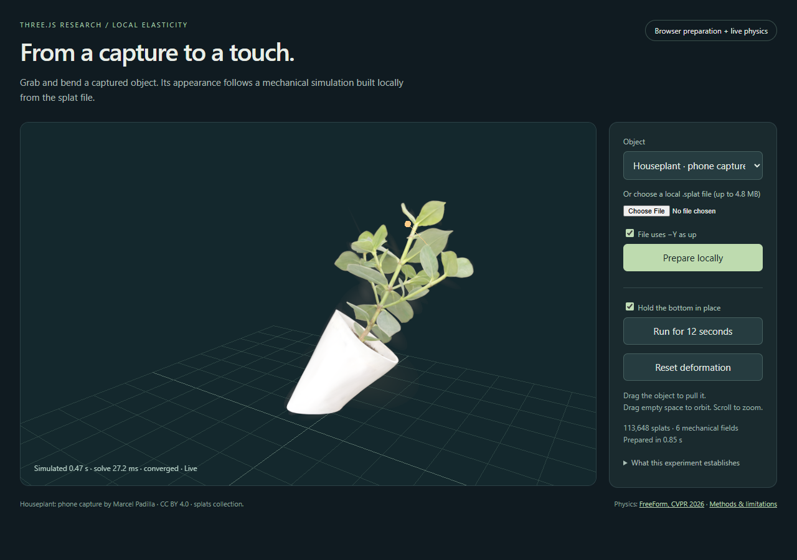

# Local elasticity for captured objects

An experimental Three.js integration of [FreeForm](https://research.nvidia.com/labs/sil/projects/freeform/),
the CVPR 2026 method by Xiang and colleagues. Load a `.splat` object, prepare its
mechanical field in a browser worker, then drag it while Three r186 renders its
deformed Gaussian appearance. Preparation uses the input file, not an
asset-specific rig, trained network, motion recording, or remote simulation.



This is a feasibility prototype. It does not establish a new physics algorithm,
physical calibration of a scan, general object support, or superiority over an
existing simulator. It is not ready to be described as an industry breakthrough.

## Run

```sh
npm ci
npm run demo:local-elasticity
```

Open the printed localhost URL in a WebGPU browser. Select **Houseplant** to use
an actual phone capture, or **Spot** for mesh-derived splats. Click **Prepare
locally**, then drag the object. The bottom starts pinned; release the pins to
allow whole-object motion. A local `.splat` file with 256 to 150,000 splats
(up to 4.8 MB) can also be selected;
unseen uploads have not been broadly evaluated. Files stay in the browser.

The app starts idle, limits each requested run to twelve seconds and caps update
requests at 30 Hz. Physics advances 1/60 second per completed solve, so playback
is intentionally slower than wall time. Hiding the page stops the worker and
disposes the renderer. Preparation has a 90-second watchdog. Numerical limits
can reject an asset. This experiment uses an isolated `three-r186` alias pinned
to 0.186.0; the older experiments retain Three 0.185.1.

## Why investigate this combination?

The plausible contribution is accessible, local preparation and simulation of
captured point-based assets, connected to an ordinary Three scene. The following
existing systems prevent broader novelty claims:

- [FreeForm](https://research.nvidia.com/labs/sil/projects/freeform/) already
  establishes the underlying mesh-free elasticity and demonstrates meshes,
  Gaussian splats, and robot interaction. Its authors own that contribution.
- [Kaolin's web framework](https://kaolin.readthedocs.io/en/web_framework_prerelease/modules/kaolin.visualize.dash.html)
  runs heavy simulation/rendering work on a server. Its July 2026 tools already
  include interactive splat physics, segmentation, and editing.
- [SoftGLB](https://github.com/meimeimei1223/SoftGLB/tree/baafe5f6a9ce37df4cd28f4261a5b95f8a96d904)
  already uploads GLB files, constructs tetrahedra, and runs soft-body interaction
  locally using WASM. Its inspected input pipeline requires triangle geometry;
  no raw Gaussian or point-cloud import was found. It does not explicitly reject
  every open mesh, so that is not claimed as a distinguishing feature.
- [PlayCanvas's splat game example](https://github.com/playcanvas/blog/blob/main/blog/2026-04-22-turning-a-gaussian-splat-into-a-videogame.md)
  already combines splats, generated collision, navigation, and NPC behavior.
  Walking through a captured scene is not this experiment's contribution.
- [Splatcarve](https://github.com/stevekwon211/splatcarve) already supports
  interactive splat carving with collision changes. Simple destruction is not
  an unoccupied research direction.

These source checks identify a deployment/integration opportunity, not proof
that no equivalent local implementation exists. The useful outcome would be a
reusable adapter that helps independently made assets become interactive with
little preparation. This first prototype tests two assets only.

## Implementation and modeling choices

`basis.mjs` independently implements the published RKPM eigenmode construction
in Float64 JavaScript. Forty-eight centers are chosen from 256 integration
points. Six scalar fields include an explicit constant field, giving 72 affine
degrees of freedom. Cholesky and symmetric eigensolves reject singular input;
there is no hidden ridge. Isotropic normalization and volume-weighted,
world-coordinate derivatives are declared choices. This is not byte-for-byte
equivalence with Kaolin's default preprocessing or its much denser examples.

`mechanics.mjs` uses the published stable Neo-Hookean energy and implicit Euler.
It analytically differentiates the entire affine-blend field. A rank-aware mass
transform removes numerically null directions with diagnostics. Newton steps
use an active set for exact linear pins and a frictionless floor at integration
samples. The cursor is a finite-stiffness spring at an arbitrary field location.
The UI limits each solve to ten Newton updates and a cooperative 100 ms budget;
its convergence status is displayed. A budget check cannot interrupt one already
running JavaScript evaluation.

`deform.js` evaluates the same affine field on the GPU. It transforms Gaussian
covariances with the full spatial Jacobian, including derivatives of the weights:
`C' = F C F^T`. This is a first-order Gaussian approximation of a nonlinear warp,
exact for an affine map. Only degree-zero appearance is supported. It depends on
a guarded private storage layout of the pinned Three
r186 `GaussianSplat` addon. Dynamic updates invalidate sorting; a conservative
center envelope controls the sort range. This is an experimental adapter, not a
proposed stable Three API. WebGL fallback is rejected.

The raw `.splat` appearance is retained. Asset coordinates are centered, uniformly
scaled, and optionally flipped from −Y up. The simulation samples source-point
positions uniformly and assigns equal weights summing to one. Those points do
**not** reveal occupied volume, real stiffness, density, or hidden internal
structure. The material is an assumed elastic model, not a recovered digital
twin. Thin parts and close but disconnected surfaces are particularly difficult.
There is no self-collision, fracture, friction, or general mesh/splat collision.
The floor constrains sampled points, not every visible Gaussian.
Picking selects a nearby projected splat center; it does not establish exact
front-surface selection through opacity or occlusion.

## Verification

```sh
npm run test:local-elasticity
node scripts/check-local-elasticity-cpu.mjs
node scripts/run-local-elasticity.mjs --asset=spot
node scripts/run-local-elasticity.mjs --asset=plant
```

`reference.py` supplies a separate NumPy/LAPACK and CPU PyTorch numerical audit.
It is a developer verification tool; Python is not needed to run the demo.
The CPU report retains complete numerical inputs, states, and source snapshots.
See [RESULTS.md](RESULTS.md) for exact records, limitations, and subsequent gates.

## Assets and credit

Both files are unmodified originals from [Marcel Padilla's splats collection](https://github.com/marcelpadilla/splats/tree/ac7f3850ceadbc0483d10c9f0b597c2ba5e89009).
`assets/manifest.json` records sizes, SHA256 hashes, provenance, and attribution.
`scripts/fetch-local-elasticity-assets.mjs` can reproduce the bounded download.

- **Houseplant:** Gaussian splat captured by Marcel Padilla, licensed
  [CC BY 4.0](https://creativecommons.org/licenses/by/4.0/).
- **Spot:** original model by Keenan Crane, CC0; mesh-to-splat conversion by
  Marcel Padilla. It is a mesh-derived representation, not a phone capture.

The new numerical implementation credits FreeForm and the inspected Apache-2.0
Kaolin source. It does not distribute Kaolin, NVIDIA model weights, or training
data. Three.js remains under its included MIT license.
