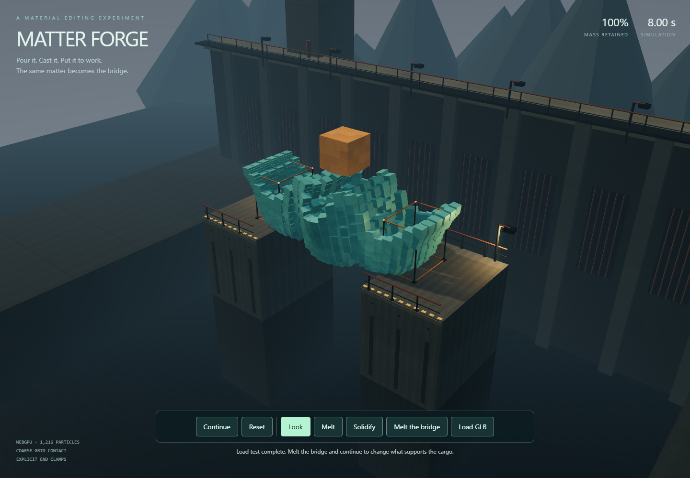

# MatterForge

MatterForge tests whether material in a Three.js scene can become something useful through physical editing: pour liquid through a grille, let a mold shape it, solidify the same particles, remove the mold, and drop cargo onto the result. The intended reusable capability is persistent material editing whose consequences affect subsequent simulation. The current result is a bounded casting experiment with a procedural rectangular body.

The revised fixture passes its declared construction test on both an independent CPU implementation and WebGPU. The live scene samples a closed Three.js mesh into particles and accepts local GLB models through the same sampler. This establishes a bounded construction workflow, not a new physics algorithm or reliable arbitrary-object construction.

From the repository root, with Node.js 22.12 or later:

```sh
npm ci
node scripts/run-matter-forge.mjs --serve
```

Open [the local demo](http://127.0.0.1:5201/) in Chrome with WebGPU available. The page starts idle and uses the repository's separate Three.js 0.186.0 installation. It requires no model download, service account, or API key.

1. Enter the foundry and choose **Pour the material**. The 1,152 liquid body particles fall through the grille into the mold; 64 cargo particles remain in an explicit holder above it.
2. After four simulated seconds, choose **Solidify & release** or **Release as liquid**. Both remove the grille, mold, and cargo holder. The banks and named end clamps remain.
3. Run the loaded stage for four more simulated seconds. Use **Reset** to repeat and choose the other material outcome. **Melt**, **Solidify**, and **Melt the bridge** edit body particles; the next simulation steps apply their consequences.

Each interactive run pauses after four simulated seconds or twelve wall-clock seconds. A wall-clock pause may require **Continue** to finish a stage. Hiding the page pauses it. **Load GLB** accepts a local, self-contained closed mesh up to 5 MiB and 4,096 triangles. Geometry is uniformly fitted into the pouring region; represented mass changes with shape, so a model may not produce enough material to reach both supports. Material base colors are retained; textures and vertex colors are not sampled. Animated, open, decoder-dependent and unsupported inputs are rejected. [The included casting blank](./assets/casting-blank.glb) is a small authored test asset, not an external benchmark model.

Actual runtime after GLB upload, casting, solidification and cargo release:



[After melting the same material, the cargo falls](./evidence/runtime-melted.png).
The [UI record](./evidence/ui-summary.json) identifies the exact source, uploaded
file and screenshots. The [packaged-reference reproduction](./evidence/reproduction-summary.json)
passes all construction gates and reproduces all 262,656 retained raw GPU values
exactly on the same browser/device. These compact records are derived summaries;
the original successful numerical report is preserved in full in the gzip archive.

The [compact CPU evidence](./evidence/cpu-summary.json) retains the protocols, original report hashes, source hashes, gates, and measurement series for all four stages of investigation. It is a derived summary, not a substitute for full particle snapshots or an independent mathematical audit. Original full reports remain in the local ignored `results/development/` paths recorded there. Rerun the CPU checks to produce new full reports:

```sh
node --test experiments/matter-forge/cpu.test.mjs
node scripts/check-matter-forge-cpu.mjs
node scripts/check-matter-forge-cuts.mjs
node scripts/check-matter-forge-casting.mjs
node scripts/check-matter-forge-casting-v2.mjs
```

The retained results are:

- **Original beam, failed:** both two-second lanes stayed finite and the solid supported cargo, but its mean cargo speed was 2.5344 against a declared maximum of 2.5.
- **Local material cut, failed:** changing 204 central beam particles to liquid preserved their state, but the four-second cargo height fell only 0.9213 relative to the intact beam; the declared minimum was 2.
- **First casting fixture, failed:** 78.24% passed the grille, but the cast missed the right clamp and its center settled below the bank tops. Final cargo heights were 4.0867 for solid and 2.4721 for liquid; both structural comparison gates failed.
- **Casting V2, passed:** the declared revision raised the mold floor, moved the bars off the supports, increased body volume from 108 to 144, and changed elastic constants from μ=80/λ=120 to μ=400/λ=600. Before release, 93.06% of the body was below the grille, each clamp contained 120 body particles, and the four central bins contained 96/92/92/96. All 2,880 executed CPU steps stayed finite. Final cargo height was 13.5933 for solid versus 2.8727 for liquid, with solid cargo mean speed 0.1128. Both branches began from exactly the same cast positions and velocities.

V2 is an explicitly revised fixture, not a rerun that replaces the earlier failures. Its grid is 24³, timestep is 1/240, particle reference volume and mass are both 0.125, and all coordinates/material constants use simulation units. A retained short GPU/CPU parity report (`matter-forge-gpu/2026-09-10T01-41-29.695Z`, SHA256 `59297dc64527e6a90405446bb98b0d323db55b5fad632e9f44f1d0ea8ac0717c`) records four passing cells. Earlier GPU attempts exposed reserved WGSL identifiers and a truncation bias in fixed-point momentum transfer; both were corrected without changing the parity tolerances.

The complete GPU casting check then passed all 12 declared gates: 93.0556% below the grille, support populations 120/120, and final cargo center heights **13.593231 solid versus 2.872686 liquid**. CPU/GPU cargo-height differences were below 0.000073 simulation units. The two released branches start from exactly the same cast; only the declared material/reference edit differs. Raw GPU metadata and complete state snapshots confirm retained particle identity and mass. One device executes three sequential simulators and is destroyed afterward. The test measures correctness, not frame rate, cross-device determinism, or simulation accuracy against the real world.

The exact successful report hashes to `4a36b8c64374c0d390df5e1b0ffaefa624be49527bd1072c6e4e444087c433bf`. Its archived source snapshots identify the executed implementation. Subsequent constructor cleanup changes leave the numerical shader source unchanged. The portable evidence verifier checks the captured runtime rather than pretending its source hash is the live checkout's hash.

Verify the retained result using Node built-ins, or reproduce the bounded GPU and UI checks:

```sh
node scripts/analyze-matter-forge.mjs --self-test
node scripts/check-matter-forge-casting-gpu.mjs
node scripts/run-matter-forge.mjs
```

The portable verifier checks the exact compressed report, source snapshots,
raw GPU particle records, identical cast states, support populations, material
edit, comparison gates, and four deliberately corrupted reports. The GPU runner
uses the included hash-pinned CPU reference rather than an ignored local file.
The UI runner exercises actual GLB upload, casting, cargo release, remelting,
serialized reset and device destruction, and records screenshots and served
source identity. These are bounded checks on one browser/device.

The liquid appearance is a display-only marching-cubes reconstruction of the
actual particle positions at resolution 48³. Its compact field has support
radius 0.5 simulation units; interpolation can extend a surface up to one grid
unit from a contributing particle. It is not volume-preserving and does not
alter collisions or particle state. Solid cells display their deformation
gradient. The distant water and architecture are scenery. The generated
[concept image](./CONCEPT.md) is separate from runtime evidence.

The model uses standard quadratic [APIC transfers](https://doi.org/10.1145/2766996) and [MLS-MPM stress scattering](https://yzhu.io/publication/mpmmls2018siggraph/paper.pdf), with pressure-based liquid and neo-Hookean elastic material. Three.js already ships a native [r186 MLS-MPM fluid example](https://github.com/mrdoob/three.js/blob/r186/examples/webgpu_compute_particles_fluid.html). Browser MPM projects already include [GLTF/GLB loading and model-based particle scattering](https://github.com/luoluobuli/WebGPU-MPM-based-Snow-Simulation). These are prior capabilities, not discoveries made here.

Material edits preserve particle IDs, mass, positions, velocities, and affine velocity state. Solidification resets the deformation gradient to the identity at the current shape; this changes stored elastic energy through an external edit. It is not simulated cooling, a thermal phase transition, or fracture. The material constants are not calibrated steel or ice.

A single shared grid velocity gives coarse, sticky coupling between body and cargo. Integer grid nodes implement the explicit obstacles and clamps. This can cause visible early contact and a gap between rendered particles; the passing CPU result has roughly a one-grid-unit gap between the lowest cargo and highest body particle centers. There is no exact surface collision or friction model. Invalid deformation determinants stop the solver rather than being silently repaired. Arbitrary brush edits, meshes, and longer runs are not guaranteed stable or load-bearing.

Implementation and associated helper scripts are covered by [LICENSE](./LICENSE).
See [third-party notices](./THIRD_PARTY_NOTICES.md) for dependency credits.
