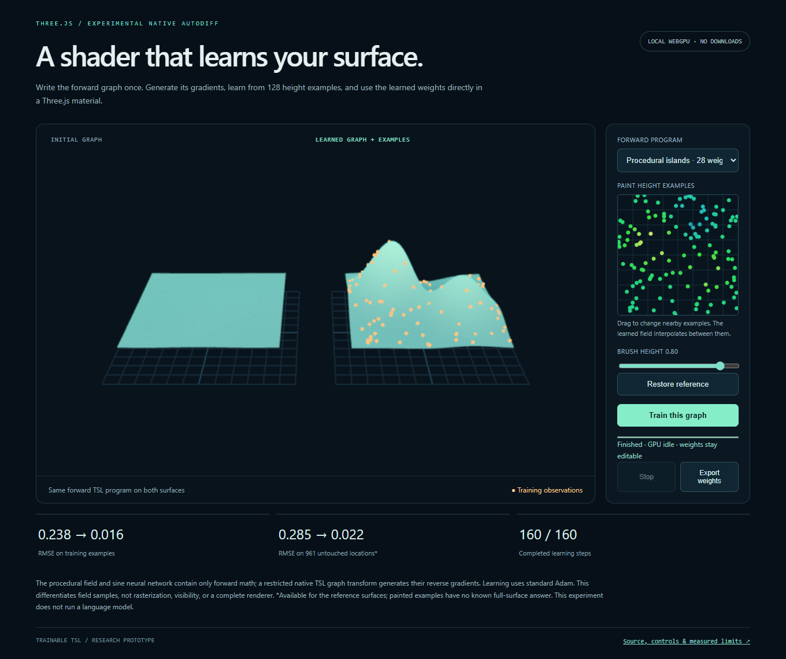

# Trainable native Three.js shader graphs

A restricted native TSL expression can provide both its forward shader and
automatically generated reverse-mode parameter gradients. This experiment uses
that transform to train two Three.js height fields on WebGPU, then renders the
learned weights through the same forward function.

The reusable contribution is the native graph transform in [autograd.js](autograd.js).
No manually authored derivative for either field, external tensor runtime,
pretrained model or language-model service is used. Standard automatic
differentiation and Adam are established techniques; the [prior-art audit](PRIOR_ART.md)
explains the narrow integration boundary. This is not a new optimizer or a
differentiable Three.js renderer.



The four-case GPU screen passed the declared capability and numerical gates.
Generated-gradient fits reduced held-out RMSE by 92.15–96.62%; GPU finite
differences reached similar accuracy and completed times. Read the
[results and portable evidence](RESULTS.md) for the full comparison and the
excluded development canary. This establishes a native training workflow for
the selected fields, without a measured optimization advantage.

## Run

From the repository root with Node 22.12+ and a WebGPU-capable Chrome:

```sh
npm ci
npm run demo:trainable-tsl
```

Open the printed localhost URL. Choose the sine neural network or movable
Gaussian islands, then train the forward graph. Each fit has 128 observations,
at most 160 updates and a 20-second training limit. It starts idle and stops
computing when the fit finishes. Restore, page hiding and early cancellation
release the GPU. The reference targets are procedural fixtures.

The small height editor changes nearby observations before training. Export
preserves the selected graph, learned parameters and observations as JSON.
Painted inputs have no full-surface reference, so their held-out score is omitted.
The fit interpolates an approximate field; it does not guarantee matching arbitrary
brush strokes, extrapolation or physically realistic terrain.

```sh
node --test experiments/trainable-tsl/autograd.test.mjs
node scripts/check-trainable-fields.mjs
node scripts/run-trainable-tsl.mjs --field=neural --seed=11
node scripts/run-trainable-tsl.mjs --field=islands --seed=11
node scripts/run-trainable-tsl.mjs --field=neural --seed=29
node scripts/run-trainable-tsl.mjs --field=islands --seed=29
node scripts/run-trainable-tsl.mjs --ui
node scripts/analyze-trainable-tsl.mjs
```

The first two checks are CPU-only. Run GPU commands sequentially; each browser
probe has a 45-second watchdog. The runner records source hashes, actual shader
code, GPU gradients, CPU references, sample/weight arrays and cleanup state in
timestamped `results/development/trainable-tsl/` reports. It preserves failures.
The [protocol](PROTOCOL.md) defines correctness and the synthetic capability gate.
The analyzer is CPU-only and verifies the compressed evidence included in this
repository; it needs no GPU or installed Three dependency.

`npm run package:trainable-tsl` creates a standalone local bundle under
`deliverables/`. In that folder, `node serve.mjs` serves the demo without an npm
installation. This bundle was also checked for painting, export, stop, page
hiding and mobile layout.

## Native graph API

```js
import {uniform, sin} from 'three/tsl';
import {gradients} from './autograd.js';

const amplitude = uniform(0.3);
const phase = uniform(0.2);
const x = uniform(0.7);
const target = uniform(0.5);
const prediction = sin(x.add(phase)).mul(amplitude);
const residual = prediction.sub(target);
const {gradients: [dAmplitude, dPhase], stats} = gradients(
  residual.mul(residual), [amplitude, phase], {constants: [x, target]}
);
// dAmplitude and dPhase are native TSL nodes, usable in a compute graph.
```

Supports floating scalar/vec2/vec3/vec4 inputs, arithmetic `+ - * /`,
`sin/cos/exp/tanh/negate/dot`, joins, swizzles and supported conversions.
Shared subgraphs and repeated components accumulate reverse contributions.
Designated inputs are exact node identities. Explicit variables, side effects,
functions, textures, control flow, unbound inputs and unsupported operations fail.
The caller must provide independent, nonaliasing input boundaries and finite
values within the math operations' domains. See the module's full contract.
The transform depends on pinned Three 0.185.1 internal node structures.

## Reuse the learned field

Load exported JSON using your application's normal local-file or asset loader.
Use its parameters directly in a material; no training runtime is required:

```js
import {MeshBasicNodeMaterial} from 'three/webgpu';
import {positionLocal, vec3, float} from 'three/tsl';
import {field} from './fields.js';

const material = new MeshBasicNodeMaterial();
const weights = saved.weights.map(value => float(value));
const height = field(saved.field, positionLocal, weights);
material.positionNode = vec3(positionLocal.x, height, positionLocal.z);
```

The exported graph identifier selects an existing authored function; JSON does
not execute generated code. The examples show a height field on a horizontal
plane. Correct deformed lighting/normals, bounds, collision, arbitrary assets and
visibility gradients are separate concerns.

## Controls and interpretation

The comparison uses central finite differences of the same forward TSL graph
on the GPU, with identical observations, initial weights, Adam reduction and
160 updates. The GPU AD path avoids maintaining a second backward program; its
lower invocation count alone is not a speed result. Captured elapsed times
include CPU submission and synchronization and are not active GPU measurements.

Both targets are noiseless, hand-authored functions. Passing the held-out gate
establishes trainability for these two selected fields, not autonomous scene
generation, a general neural reconstruction system or superiority over Slang,
jax-js, specialized handwritten backward kernels or other optimizers.
